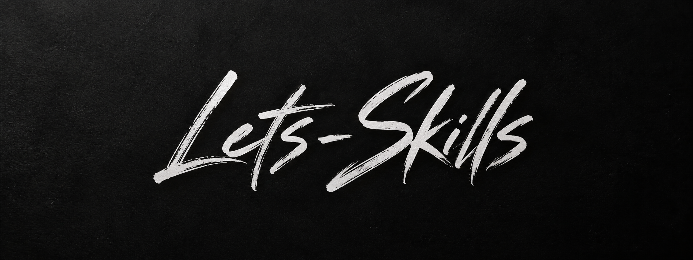

<p align="center">
  
</p>

Three skills that hand work to each other. Design a system, draw it, build it.

```
grilling  ->  lets-design  ->  lets-draw  ->  lets-code
gather        argue it out     draw it       build it
```

Each stage produces a file the next one reads. You can start at any stage that has its
input, and stop at any stage whose output is all you wanted.

## Philosophy

Let the agent do precise work.

An agent given a vague brief produces plausible bulk: code that compiles and says nothing,
a design that names every service and decides nothing, a diagram that renders and cannot be
read. More output is not more work done. It is more to review, and review is where the time
actually goes.

So these skills are built to narrow rather than expand. Fewer components, fewer lines, each
argued for. Deterministic checks wherever a judgement can be replaced by arithmetic, because
a check that fails is worth more than a rule that is ignored. Every skill here has a seat at
the table whose only job is to argue for deletion.

An agent also moves faster than you can hold in your head, so every tool here writes down
what it decided and why, as it goes. The state of the work is something you check rather
than something you remember.

None of this starts from scratch. `lets-design` gets its requirements by chaining to Matt
Pocock's `grilling`. `lets-code` shows what it built with humanlayer's `show-me` and puts
every landed task through `ponytail-review`. Those skills solve their part well, and reusing
them beats writing a worse second version of each. The same rule applies to a skill added
here: if something good already exists, pin to it and give it the credit. They are listed
under [Dependency skills](#dependency-skills), install them alongside this plugin.

Less is more, precise beats plausible, and you should still understand the system after
the agent is done.

## Install

```sh
claude plugin marketplace add kevinyecs/skills
claude plugin install lets-skills@kevinye-skills
```

## lets-design

Designs a distributed system for a real project on a chosen cloud, and writes down why.

It refuses to design without requirements, and chains to `grilling` to get them. Then a
proposer drafts an architecture and three advocates attack it in parallel: one for
reliability, one for security, and one for simplicity and cost. A judge resolves the
conflicts and names the trade-offs it accepted.

The third advocate is the one that matters. Without a seat arguing for deletion, review
only ever adds, and you end up with a design that satisfies every reviewer and no budget.

Output is `docs/design/SOLUTION-DESIGN.md`. Per component: what it does here, why it beat
the alternatives for this project, what you must know to operate it, and how it fails.

## lets-draw

Turns that design into a multi page `.drawio` file that is actually readable.

One branch per page, running in parallel. Each branch has a generator and its own reviewer,
and the reviewer is spawned fresh every round and never sees the generator's context. It
reads the design as well as the render, so it can catch a connection that does not exist,
not just an ugly one. A branch stops when its own reviewer passes. The run stops when all
of them have.

This shape exists because a generator cannot review its own layout. A real run produced a
diagram that passed every structural check and was unreadable in a dozen places.

Between the two sits `validate-drawio.js`, because almost every way of corrupting a
`.drawio` file fails silently. A bad `parent` attribute deletes the rest of the page and
still exports a PNG successfully. The validator checks structure, contrast, overlap, label
collisions and page shape, and a `PostToolUse` hook runs it on every write.

## lets-code

Implements a plan through sub-agents on four model tiers, cheapest one that can do the job.

The session that invokes it stops writing code and becomes the orchestrator. It splits the
work, scopes each task, delegates, reviews what comes back, and keeps the plan updated.
Independent tasks run in parallel, dependent ones wait.

Before delegating anything it establishes the project's conventions and hands them to every
sub-agent, because three sub-agents left to infer structure produce three different
structures.

## Hooks

| Event | Does |
|---|---|
| `Stop` | Reads the plan's status table and refuses to end the session while a task is pending, or landed but unreviewed |
| `SubagentStart` | Injects the project conventions into every sub-agent, since session context never reaches them |
| `PostToolUse` | Runs the drawio validator on any `.drawio` file just written |

## Dependency skills

These are separate plugins this one leans on. Install them if you want the pipeline to work
as written.

| Plugin | Repo | Used by |
|---|---|---|
| `grilling` and friends | [mattpocock/skills](https://github.com/mattpocock/skills) | `lets-design` chains to `grilling` for its context gate |
| `show-me` and friends | [humanlayer/skills](https://github.com/humanlayer/skills) | `lets-code` uses `show-me` to show what was built |
| `ponytail` | [DietrichGebert/ponytail](https://github.com/DietrichGebert/ponytail) | `lets-code` runs `ponytail-review` on every landed task |

## License

MIT. Use it, fork it, ship it, sell it.

## Where this is going

Every stage leaves an artifact rather than a conversation. `lets-design` writes the
reasoning, not just the component list. `lets-draw` writes a diagram that has to survive a
validator and a reviewer. `lets-code` keeps a plan with a status column and a Stop hook that
will not let the session end while a task is unreviewed. Conventions live in a file injected
into every sub-agent rather than in the head of whoever started the session.

The goal is a toolkit that covers the whole lifecycle this way, not one clever prompt.
Design, draw and build are done. Test, verify, review, deploy, operate and document are not,
and each has the same shape of problem: an agent will happily produce something plausible,
and you need an artifact plus a check that says whether it is right.

### Planned

None of these are designed yet. The list is here so the shape of the toolkit is visible
before the work starts, and so anything picked up gets held to the same bar as the three
that exist: an artifact a human can read, and a check instead of a judgement wherever one
will fit.

They fall into three families rather than seven separate ideas, which is also the order
worth building them in.

**Context in.** Everything upstream of a decision. `lets-design` currently assumes the
codebase and the outside context are already understood, and nothing here supplies them.

| Skill | Does | Status |
|---|---|---|
| `lets-understand` | Explain any concept, not only code. A codebase, a service, a design choice, a git diff, or something being learned from scratch | not started |
| `lets-gather` | Pull together the context a project already has: SoW, scope, Slack, Jira, the codebase, and call transcripts where they exist and their use is approved | not started |
| `lets-message` | Write one targeted message for a coworker or a customer. Audience, intent, and what they do next, not a wall of text. The outbound half of gathering, for context that only lives in someone's head | not started |

**Independent review.** Both spawn reviewers that never saw the work being reviewed, because
an author marking their own homework is the failure mode. Same machinery, different lens, so
the second is cheap once the first exists.

| Skill | Does | Status |
|---|---|---|
| `lets-review` | Review any change or implementation through fresh external sub agents, each independent of the one that wrote it | not started |
| `lets-secure` | The same shape aimed only at security. Proposes changes and never implements them itself | not started |

**Opinionated operations.** Both encode preferences rather than hardcode them. Sensible
defaults shipped, every one of them overridable.

| Skill | Does | Status |
|---|---|---|
| `lets-git` | Git actions with your conventions written down: how a commit message reads, how a PR is described, when a large change is split across several | not started |
| `lets-deploy` | Ship it, on the same pattern. Clean defaults you can replace, and a check that says whether it actually landed | not started |

Bring one. A skill belongs here if it makes an agent more precise, leaves an artifact a
human can read, and replaces a judgement with a check where it can.
